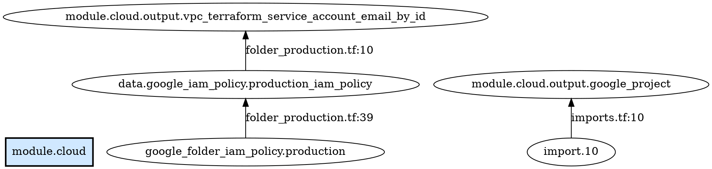

# tfref

`tfref` is a Go library and CLI tool for tracing **all references to a Terraform / OpenTofu symbol** in a workspace — directly and transitively, across module boundaries — with exact file:line:col positions for every reference edge.

Given a target like `module.cloud`, `local.result`, or `module.foo.aws_s3_bucket.mybucket`, `tfref` tells you **everything that depends on it** (or what it depends on), following the reference chain as deeply as needed.

It is designed to be used as a **GitHub Copilot skill**: clone the repo, then invoke it from any TF/OpenTofu workspace to answer questions like *"identify everything that derives from module.cloud"*.

---

## Features

- Parses `.tf` and `.tofu` files (both extensions, mixed workspaces supported)
- Uses the official `hashicorp/hcl/v2` library — handles all expression types:
  - String interpolation: `"${module.foo.result}"`
  - Ternary: `condition ? a : b`
  - For-expressions: `[for x in module.foo.list : x.id]`
  - Splats: `aws_instance.web[*].id`
  - Bracket access: `resource["name"].attr`
  - `depends_on = [module.foo]`
- Detects references in **`import`, `moved`, and `removed` blocks** — these are reported with
  synthetic node names (`import.LINE`, `moved.LINE`, `removed.LINE`) so that operations like
  removing or moving a module surface every administrative block that must also be updated
- Resolves child modules via relative paths (`./modules/...`) and the
  `.terraform/modules/modules.json` cache (from `terraform init` / `tofu init`)
- Tracks `local.<name>` at individual attribute granularity (not the whole locals block)
- Correctly handles `for_each` and `count` module instances:
  - `module.foo["prod"].output_x` → normalized to `module.foo` (instance key stripped)
  - `module.foo[each.key].output_x` → same
  - `module.foo[0].output_x` → same
- Carries exact `hcl.Range` (file + start/end line + column) for every reference edge
- Precise module boundary tracing: `module.baz` is excluded from a `module.foo` search
  if `baz` only depends on an output of `bar` that doesn't flow from `foo`
- Works with remote backends — no credentials or `terraform plan` needed
- Errors explicitly if a module's source cannot be resolved (prevents silent incomplete results)

---

## Installation as a Copilot Skill

```bash
git clone https://github.com/eriksw/tfref ~/.copilot/skills/tfref
```

No binary needed — the skill is invoked from source using the Go toolchain.

## Standalone installation

```bash
go install github.com/eriksw/tfref/cmd/tfref@latest
```

---

## CLI Usage

```
tfref [flags] [WORKSPACE] TARGET

  WORKSPACE  path to workspace root (default: current directory)
  TARGET     full Terraform address (see Address Format below)

flags:
  -direction string
    	traversal direction: backward (who depends on target) or forward (what does target depend on) (default "backward")
  -format string
    	output format: dot (default, Graphviz), json
  -show-internals
    	include nodes internal to the target module in output
```

Flags may be placed before or after positional arguments.

### Examples

```bash
# Find everything that (directly or transitively) references module.cloud
tfref . module.cloud

# Same, with JSON output for machine consumption
tfref . module.cloud --format json

# What does module.cloud itself depend on?
tfref . module.cloud --direction forward

# A resource inside a child module
tfref . module.foo.aws_s3_bucket.mybucket

# From the workspace directory (uses CWD)
cd /path/to/workspace && tfref module.cloud
```

### Example DOT Output



Render it:
```bash
# In the browser (paste output):
# https://dreampuf.github.io/GraphvizOnline/

# Locally:
tfref . module.cloud | dot -Tsvg -o refs.svg && open refs.svg
```

**Reading the graph**: arrows point from dependent → dependency (bottom-to-top). The target is highlighted in blue.  `import.N`, `moved.N`, and `removed.N` nodes represent administrative blocks at source line N — these must be updated or removed when restructuring the target.

### Example JSON Output

```json
{
  "target": "module.cloud",
  "direction": "backward",
  "workspace": "/path/to/tf-google-organization",
  "node_count": 4,
  "nodes": [
    {
      "full_addr": "local.cloud",
      "addr": "local.cloud",
      "depth": 1,
      "file": "outputs.tf",
      "line": 17,
      "column": 11,
      "via": "module.cloud"
    }
  ]
}
```

---

## Address Format

Addresses follow standard Terraform reference syntax, with module path encoded as leading `module.NAME` segments.

| Full address | ModulePath | Addr |
|---|---|---|
| `module.cloud` | `""` (root) | `module.cloud` |
| `local.cloud` | `""` (root) | `local.cloud` |
| `module.foo.aws_s3_bucket.mybucket` | `"module.foo"` | `aws_s3_bucket.mybucket` |
| `module.foo.output.result` | `"module.foo"` | `output.result` |
| `module.foo.module.bar.local.x` | `"module.foo/module.bar"` | `local.x` |

**Parsing rule**: greedily consume leading `module.NAME` pairs while at least 2 parts remain; the remainder is the addr in that module scope.

### Type prefixes

| Type | Example |
|---|---|
| Resource | `aws_instance.web` |
| Data source | `data.aws_ami.ubuntu` |
| Variable | `var.region` |
| Local value | `local.bar` |
| Module call | `module.foo` |
| Output value | `output.result` |

In output, nodes inside a child module are shown with `::` separating module path from addr:

```
module.networking::aws_subnet.public
module.networking/module.vpc::var.cidr
```

---

## Module Resolution

- **Relative paths** (`./modules/foo`, `../shared`): resolved relative to caller directory. If the directory does not exist, `tfref` returns an error.
- **Registry / remote modules**: looked up in `.terraform/modules/modules.json` (populated by `terraform init` or `tofu init`). If not present, `tfref` returns an error with a hint to run init.

---

## Go API

```go
import "github.com/eriksw/tfref"

graph, err := tfref.ParseWorkspace("./my-workspace")
if err != nil {
    panic(err)
}

// Parse a full address string
target := tfref.ParseFullAddr("module.foo")   // NodeID{"", "module.foo"}
target2 := tfref.ParseFullAddr("module.foo.aws_s3_bucket.mybucket") // NodeID{"module.foo", "aws_s3_bucket.mybucket"}

// Backward: who depends on target?
results := tfref.DeepBackwardRefs(graph, target)

// Forward: what does target depend on?
results2 := tfref.DeepForwardRefs(graph, target)

for _, r := range results {
    fmt.Printf("[depth %d] %s references %s @ %s:%d:%d\n",
        r.Depth,
        r.Ref.From,
        r.Ref.To,
        r.Ref.Subject.Filename,
        r.Ref.Subject.Start.Line,
        r.Ref.Subject.Start.Column,
    )
}
```

### Key Types

```go
// NodeID uniquely identifies a node within a specific module scope.
type NodeID struct {
    ModulePath string // "" = root; "module.foo" or "module.foo/module.bar"
    Addr       string // e.g. "aws_instance.web", "var.cidr", "local.bar"
}

// Ref is a single directed reference edge with source position.
type Ref struct {
    From    NodeID
    To      NodeID
    Subject hcl.Range // exact file/line/column of the reference token
}

// BackwardResult is one entry from a transitive traversal.
type BackwardResult struct {
    Ref   Ref
    Depth int // 1 = direct reference, 2 = one hop away, etc.
}
```

---

## Limitations

| Limitation | Notes |
|---|---|
| Remote/registry modules | Requires `terraform init` / `tofu init` to populate `.terraform/modules/modules.json` |
| `for_each` cardinality | All instances of `module.foo[*]` map to the same `module.foo` node — instance-level distinction is not tracked |
| `.tfvars` files | Not currently parsed |
| Dynamic expressions | `for_each = var.X` is tracked but the set of instances is not evaluated |

---

## Development

```bash
git clone https://github.com/eriksw/tfref
cd tfref
go test ./...
```

## License

MIT