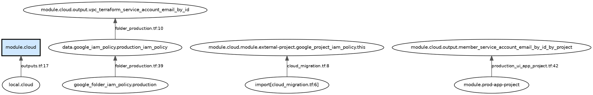

# tfref — Terraform Reference Tracer

## What this skill does

Given a target Terraform address (e.g. `module.cloud`, `local.result`, `module.foo.aws_s3_bucket.mybucket`), `tfref` returns **every node in the workspace that directly or transitively references that target**, across module boundaries, with exact file:line positions for every reference edge.

It works by parsing `.tf` and `.tofu` source files directly — no `terraform plan`, no credentials, no remote state access required. All expression types are handled: string interpolation (`"${module.foo.result}"`), ternary, for-expressions, splats, bracket access, and `depends_on`.

**Important behaviors:**
- If the target address does not exist in the workspace, the tool exits with an error. A target with no references is fine; a mistyped address is an error.
- `import`, `moved`, and `removed` blocks are always reported as references. When planning to remove or move a module/resource, these blocks **must** be dealt with — the tool ensures they are never silently omitted.
- A resource is considered to exist if it has a defining block (`resource`, `module`, `data`, etc.) **or** if it is the target of an `import`, `moved`, or `removed` block.

## How to invoke

The binary is under `cmd/tfref`. When running from the cloned skill directory:

```bash
cd ~/.copilot/skills/tfref && go run ./cmd/tfref/... <workspace-dir> <target-addr> [flags]
```

Or if installed via `go install github.com/eriksw/tfref/cmd/tfref@latest`:

```bash
tfref <workspace-dir> <target-addr> [flags]
```

`WORKSPACE` defaults to the current directory if omitted:

```bash
cd /path/to/workspace && go run ./cmd/tfref/... module.cloud
```

**Flags:**
- `--format dot` — Graphviz DOT graph (default); renderable at https://dreampuf.github.io/GraphvizOnline/
- `--format json` — machine-readable JSON; recommended for skill/model use
- `--direction backward` — who depends on target? (default)
- `--direction forward` — what does target depend on?

## Address format

Addresses encode module nesting as leading `module.NAME` segments:

| Address | Meaning |
|---|---|
| `module.cloud` | The `module "cloud"` call in the root module |
| `local.result` | `local.result` in the root module |
| `aws_instance.web` | Resource in the root module |
| `data.google_project.main` | Data source in the root module |
| `module.foo.aws_s3_bucket.mybucket` | `aws_s3_bucket.mybucket` inside module `foo` |
| `module.foo.output.result` | `output "result"` inside module `foo` |
| `module.foo.module.bar.local.x` | `local.x` inside module `bar` inside module `foo` |

## Example: DOT output (default)

```bash
cd ~/.copilot/skills/tfref && go run ./cmd/tfref/... /path/to/workspace module.cloud
```



**Reading the DOT graph:**
- Arrows point **from dependent → dependency** (bottom-to-top in rendered layout)
- The target node is highlighted in blue
- Edge labels show `file:line` of the reference expression
- `import[file.tf:N]`, `moved[file.tf:N]`, `removed[file.tf:N]` nodes are administrative blocks at source line N — they **must** be updated or removed when restructuring the target
- Edge targets show the exact node inside the module being referenced (e.g. `module.cloud.output.vpc_sa_email`), not just `module.cloud`

Render locally: `go run ./cmd/tfref/... . module.cloud | dot -Tsvg -o refs.svg && open refs.svg`

## Example: JSON output

```bash
cd ~/.copilot/skills/tfref && go run ./cmd/tfref/... /path/to/workspace module.cloud --format json
```

```json
{
  "target": "module.cloud",
  "direction": "backward",
  "workspace": "/path/to/workspace",
  "node_count": 354,
  "nodes": [
    {
      "full_addr": "local.cloud",
      "addr": "local.cloud",
      "depth": 1,
      "file": "outputs.tf",
      "line": 17,
      "column": 11,
      "via": "module.cloud"
    },
    {
      "full_addr": "import[cloud_migration.tf:6]",
      "addr": "import[cloud_migration.tf:6]",
      "depth": 1,
      "file": "cloud_migration.tf",
      "line": 8,
      "column": 8,
      "via": "module.cloud.module.external-project.google_project_iam_policy.this"
    },
    {
      "full_addr": "module.prod-app-project",
      "addr": "module.prod-app-project",
      "depth": 1,
      "file": "production_ui_app_project.tf",
      "line": 42,
      "column": 25,
      "via": "module.cloud.output.member_service_account_email_by_id_by_project"
    }
  ]
}
```

**Interpreting JSON fields:**
- `full_addr` — full Terraform address of the node that contains the reference
- `module_path` — present only when the node is inside a child module
- `addr` — local address of the node within its module
- `depth` — hops from target (1 = direct reference, 2 = references something that references target, etc.)
- `file`, `line`, `column` — exact source location of the reference expression
- `via` — the specific node being referenced (which may be an output or resource inside the target module)

## Example: forward search

```bash
cd ~/.copilot/skills/tfref && go run ./cmd/tfref/... /path/to/workspace module.cloud --direction forward --format json
```

Returns everything `module.cloud` itself depends on.

## Module resolution

- Relative module sources (`./modules/networking`) are resolved from the workspace directory
- Remote/registry modules are resolved via `.terraform/modules/modules.json` (populated by `terraform init` / `tofu init`)
- If a module cannot be resolved, the tool returns an **error** rather than silently returning incomplete results — the error message will tell you to run `terraform init` or `tofu init`

## When to use this skill

- *"What would change if I remove or move module.cloud?"* — use backward search; pay special attention to any `import[...]`, `moved[...]`, `removed[...]` nodes in the result
- *"Identify everything in this workspace that derives from module.cloud"*
- *"Find all places that reference var.region so I can update them"*
- *"Does module.baz depend on module.foo?"* — use forward search on module.baz, look for module.foo in results
- *"What does module.cloud depend on?"* — use forward search

## Limitations

- `for_each` instances are normalized: `module.foo["prod"].output` and `module.foo["staging"].output` both trace to the same `module.foo` node — instance-level distinction is not tracked
- `.tfvars` files are not parsed
- Registry modules require a local `.terraform/` cache from `terraform init` / `tofu init`
